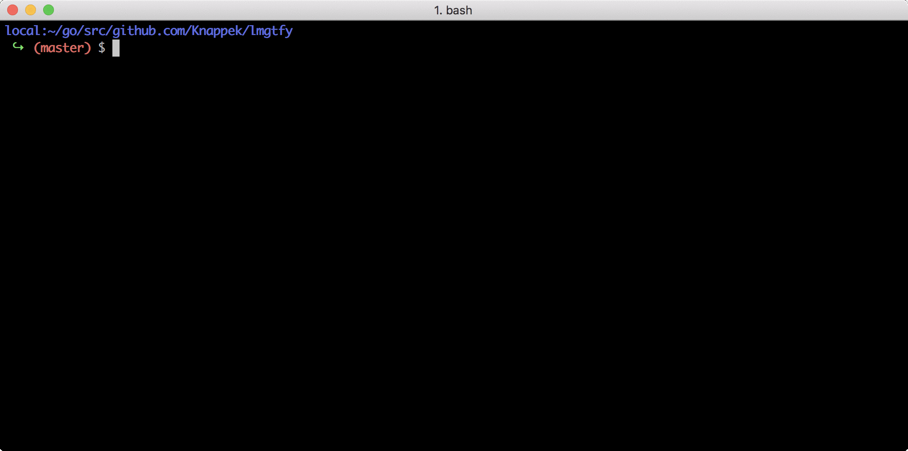

# Let me google that for you CLI

[](https://github.com/Knappek/lmgtfy/releases/latest)
[](https://travis-ci.org/Knappek/lmgtfy)
[](https://goreportcard.com/report/Knappek/lmgtfy)
[](LICENSE.md)
[](https://github.com/goreleaser)

This is a [lmgtfy](https://github.com/pykler/lmgtfy) CLI written in Go which makes it easy to create Let me google that for you links.

## Install

### MacOS

```shell
brew install Knappek/tap/lmgtfy
```

### Other OS with Go installed

Download with

```shell
go get github.com/Knappek/lmgtfy
```

and install `lmgtfy` CLI by navigating to `$GOPATH/src/github.com/Knappek/lmgtfy/` and run

```shell
go install
```

In order to use `lmgtfy` make sure `$GOPATH/bin` is in your PATH.

### Without Go installed

You can simply download the latest release from the [release](https://github.com/Knappek/lmgtfy/releases) page, extract it and move the binary to your path.


## Usage

<p align="center">

</p>

In a shell, simply type

```shell
lmgtfy -g "What is Let me google that for you?"
```

which will print http://lmgtfy.com/?q=What+is+Let+me+google+that+for+you%3F and, if you are on Linux or MacOS, will directly copy it to your clipboard.

### Shorten Url

The lmgtfy-Url is very obvious and you may want to hide this. Simply add a `-s` or `-shorten`, i.e.

```shell
lmgtfy -g "What is Let me google that for you?" -s
```

which will print http://tinyurl.com/3so56ko and, if you are on Linux or MacOS, will directly copy it to your clipboard.

# Next Steps

* code lint
* code coverage
